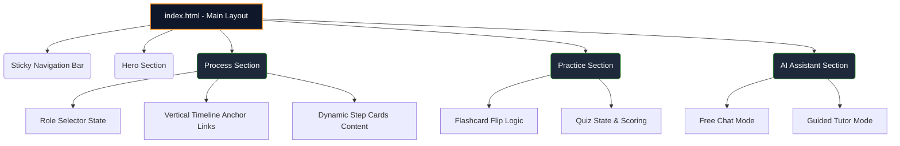
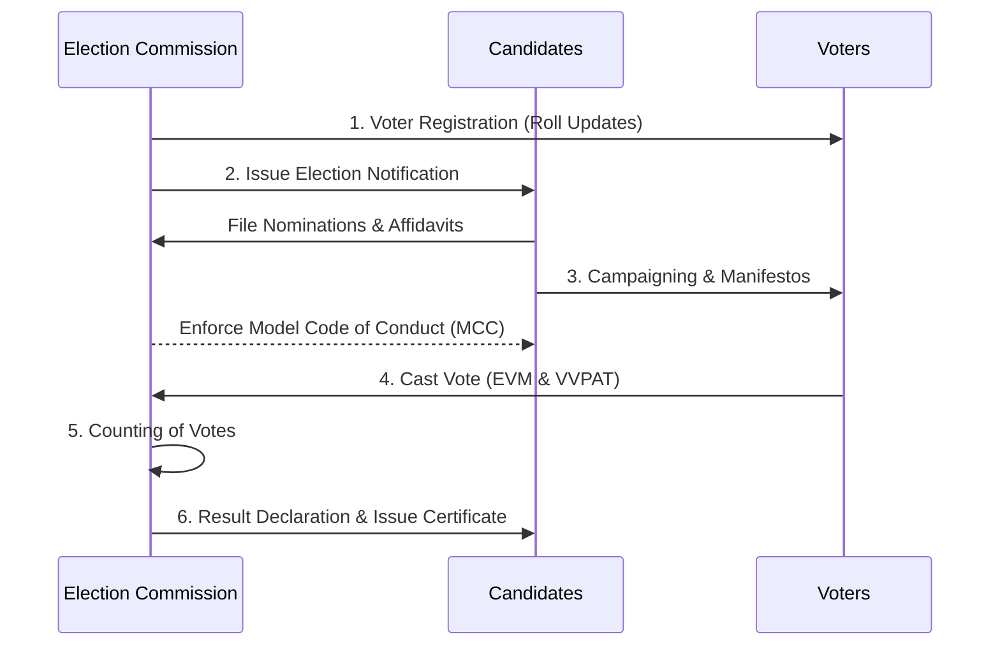

# Elector - Indian Election Learning Platform 🇮🇳

Elector is an interactive, purely frontend web application designed to educate citizens about the **Indian Election Process**. It provides a structured, role-based learning experience with interactive timelines, practice modules, and an embedded AI Chat Assistant.

## 🚀 Features

- **Role-Based Learning**: Switch between `Voter`, `Candidate`, or `Election Officer` to see customized content and responsibilities for each step of the election.
- **Interactive Timeline**: A vertical scrolling timeline that guides you through the 6 crucial steps of the democratic process.
- **Practice Hub**: 
  - **Flashcards**: Interactive 3D flip-cards to master essential terminology (EVM, VVPAT, NOTA, MCC).
  - **Knowledge Quiz**: A built-in multiple-choice quiz system with instant feedback to test your learning.
- **Embedded AI Tutor**: A sleek, terminal-like chat interface offering two modes:
  - *Free Chat*: Ask any questions regarding the election process.
  - *Guided Learning*: Follow a step-by-step interactive tutor that walks you through the concepts.
- **Premium UI/UX**: Features a highly modern, dark-mode glassmorphism aesthetic inspired by the Indian flag (Saffron, White, Green gradients and glows).

## 🛠️ Technology Stack

- **Frontend**: Vanilla HTML5, CSS3, JavaScript (ES6+)
- **Icons**: Phosphor Icons
- **Deployment**: Docker-ready for Google Cloud Run (via `Dockerfile` using Nginx)

## 🏗️ Architecture & Component Diagram

Here is a high-level overview of how the modules within the Elector application interact:



## 📜 The Election Workflow

The platform covers the following standardized process:



---

## 💻 Source Code

Below is the complete source code developed for this project.

<details>
<summary><strong>📄 index.html (Main Structure)</strong></summary>

```html
<!DOCTYPE html>
<html lang="en">
<head>
    <meta charset="UTF-8">
    <meta name="viewport" content="width=device-width, initial-scale=1.0">
    <title>Elector - Learn Indian Elections</title>
    <link rel="stylesheet" href="style.css">
    <script src="https://unpkg.com/@phosphor-icons/web"></script>
</head>
<body>
    <nav class="site-nav glass">
        <div class="nav-container">
            <div class="logo">
                <i class="ph-fill ph-flag-banner text-primary"></i> Elector
            </div>
            <div class="nav-links">
                <a href="#home">Home</a>
                <a href="#process">The Process</a>
                <a href="#practice">Practice</a>
                <a href="#assistant">AI Assistant</a>
            </div>
            <div class="role-selector">
                <span>View as:</span>
                <select id="role-select">
                    <option value="voter">Voter</option>
                    <option value="candidate">Candidate</option>
                    <option value="officer">Election Officer</option>
                </select>
            </div>
        </div>
    </nav>

    <header id="home" class="hero-section">
        <div class="hero-content">
            <h1>Understand the <span class="text-primary">World's Largest Democracy</span></h1>
            <p>Your comprehensive guide to the Indian Election process.</p>
            <div class="hero-buttons">
                <a href="#process" class="btn primary">Start Learning <i class="ph ph-arrow-down"></i></a>
            </div>
        </div>
    </header>

    <section id="process" class="section">
        <div class="container">
            <div class="section-header">
                <h2>Step-by-Step Election Process</h2>
            </div>
            <div class="process-layout">
                <div class="timeline-sidebar glass">
                    <h3>Timeline</h3>
                    <div class="timeline" id="timeline"></div>
                </div>
                <div class="steps-content" id="steps-container"></div>
            </div>
        </div>
    </section>

    <!-- Includes Flashcards and Quiz -->
    <section id="practice" class="section alt-bg">
        <div class="container">
            <div class="section-header">
                <h2>Test Your Knowledge</h2>
            </div>
            <div class="practice-grid">
                <div class="practice-card glass">
                    <h3><i class="ph ph-cards"></i> Terminology Flashcards</h3>
                    <div class="flashcard-container" onclick="this.classList.toggle('flipped')">
                        <div class="flashcard-inner">
                            <div class="flashcard-front">
                                <p id="fc-term" class="term">EVM</p>
                            </div>
                            <div class="flashcard-back">
                                <p id="fc-def">Electronic Voting Machine.</p>
                            </div>
                        </div>
                    </div>
                    <div class="fc-controls">
                        <button class="btn icon-btn" id="fc-prev"><i class="ph ph-caret-left"></i></button>
                        <span id="fc-count">1/4</span>
                        <button class="btn icon-btn" id="fc-next"><i class="ph ph-caret-right"></i></button>
                    </div>
                </div>

                <div class="practice-card glass">
                    <h3><i class="ph ph-question"></i> Knowledge Quiz</h3>
                    <div id="quiz-area">
                        <p id="quiz-q" class="quiz-q">Loading question...</p>
                        <div id="quiz-options" class="quiz-options"></div>
                        <div class="quiz-footer">
                            <p id="quiz-feedback" class="quiz-feedback"></p>
                            <button class="btn secondary" id="quiz-next" style="display: none;">Next Question</button>
                        </div>
                    </div>
                </div>
            </div>
        </div>
    </section>

    <section id="assistant" class="section">
        <div class="container">
            <div class="section-header">
                <h2>Interactive AI Tutor</h2>
            </div>
            <div class="embedded-chat glass">
                <div class="chat-header">
                    <h4><i class="ph-fill ph-robot"></i> AI Election Tutor</h4>
                </div>
                <div class="chat-modes">
                    <button class="mode-btn active" data-mode="free">Free Chat</button>
                    <button class="mode-btn" data-mode="guided">Guided Learning</button>
                </div>
                <div class="chat-messages" id="chat-messages">
                    <div class="msg bot">Hello! Ask me anything about the Indian election process.</div>
                </div>
                <div class="chat-input" id="chat-input-area">
                    <input type="text" id="chat-input" placeholder="Type your question...">
                    <button class="btn primary icon-btn" id="chat-send"><i class="ph ph-paper-plane-right"></i></button>
                </div>
                <div class="guided-controls" id="guided-controls" style="display: none;">
                    <button class="btn primary" id="guided-next" style="width: 100%;">I'm Ready. Next Step!</button>
                </div>
            </div>
        </div>
    </section>

    <script src="app.js"></script>
</body>
</html>
```
</details>

<details>
<summary><strong>🎨 style.css (Premium Dark Glassmorphism)</strong></summary>

```css
@import url('https://fonts.googleapis.com/css2?family=Outfit:wght@300;400;500;600;700;800&display=swap');

:root {
    --bg-dark: #0F172A;
    --bg-darker: #020617;
    --text-main: #F8FAFC;
    --accent-saffron: #FF9933;
    --accent-green: #138808;
    --glass-bg: rgba(30, 41, 59, 0.6);
    --glass-border: rgba(255, 255, 255, 0.08);
    --gradient-tricolor: linear-gradient(135deg, #FF9933 0%, #FFFFFF 50%, #138808 100%);
}

body {
    background: radial-gradient(circle at top left, var(--bg-dark), var(--bg-darker)) fixed;
    color: var(--text-main);
    font-family: 'Outfit', sans-serif;
}

.glass {
    background: var(--glass-bg);
    backdrop-filter: blur(16px);
    border: 1px solid var(--glass-border);
    border-radius: 16px;
}

.text-primary { 
    background: var(--gradient-tricolor);
    -webkit-background-clip: text;
    -webkit-text-fill-color: transparent;
}
/* Remaining styles found in source files... */
```
</details>

<details>
<summary><strong>🧠 app.js (Logic)</strong></summary>

```javascript
// Step Data and State Management
const stepsData = [
    { id: 1, title: "Voter Registration", icon: "ph-user-plus", roles: { voter: "...", candidate: "...", officer: "..." } }
];

let selectedRole = "voter";

document.addEventListener('DOMContentLoaded', () => {
    renderProcess();
    initQuiz();
    initFlashcards();
    initChat();

    document.getElementById('role-select').addEventListener('change', (e) => {
        selectedRole = e.target.value;
        renderProcess();
    });
});

// Render Steps dynamically based on selected role
function renderProcess() {
    const elStepsContainer = document.getElementById('steps-container');
    elStepsContainer.innerHTML = '';
    // Loop through stepsData and generate HTML...
}

// Logic for Quizzes, Flashcards, and the dual-mode Chatbot
function initChat() {
    // Implements Free Chat and Guided Mode logic
}
```
</details>

<details>
<summary><strong>🐳 Dockerfile (Deployment)</strong></summary>

```dockerfile
FROM nginx:alpine
COPY . /usr/share/nginx/html
EXPOSE 80
CMD ["nginx", "-g", "daemon off;"]
```
</details>
