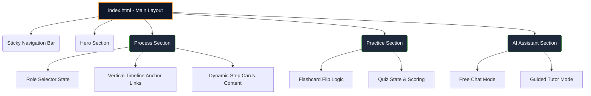
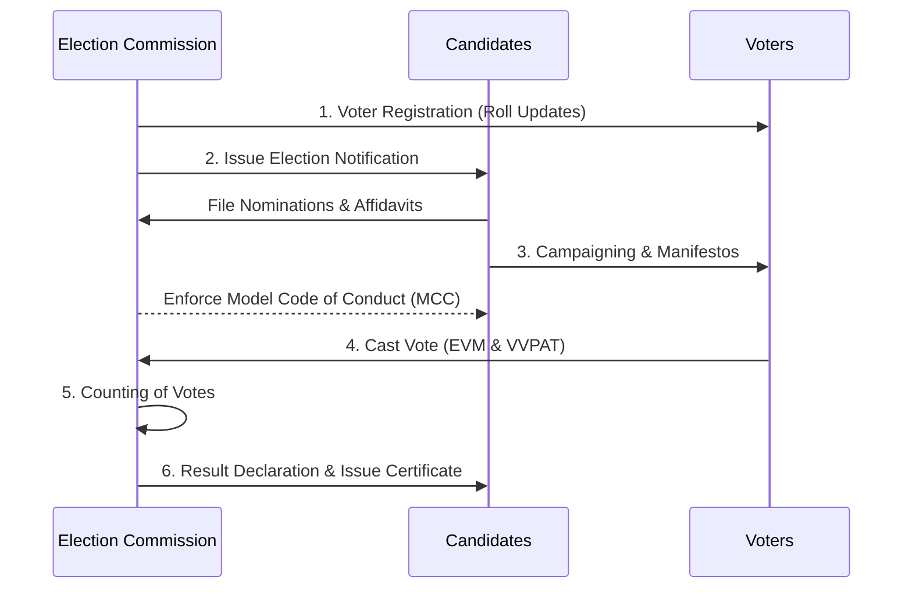

# Elector - Indian Election Learning Platform 🇮🇳

Elector is an interactive, purely frontend web application designed to educate citizens about the **Indian Election Process**. It provides a structured, role-based learning experience with interactive timelines, practice modules, and an embedded AI Chat Assistant.

## 🚀 Features

- **Role-Based Learning**: Switch between `Voter`, `Candidate`, or `Election Officer` to see customized content and responsibilities for each step of the election.
- **Interactive Timeline**: A vertical scrolling timeline that guides you through the 6 crucial steps of the democratic process.
- **Practice Hub**: 
  - **Flashcards**: Interactive 3D flip-cards to master essential terminology (EVM, VVPAT, NOTA, MCC).
  - **Knowledge Quiz**: A built-in multiple-choice quiz system with instant feedback to test your learning.
- **Embedded AI Tutor**: A sleek, terminal-like chat interface offering two modes:
  - *Free Chat*: Ask any questions regarding the election process.
  - *Guided Learning*: Follow a step-by-step interactive tutor that walks you through the concepts.
- **Premium UI/UX**: Features a highly modern, dark-mode glassmorphism aesthetic inspired by the Indian flag (Saffron, White, Green gradients and glows).

## 🛠️ Technology Stack

- **Frontend**: Vanilla HTML5, CSS3, JavaScript (ES6+)
- **Icons**: Phosphor Icons
- **Deployment**: Docker-ready for Google Cloud Run (via `Dockerfile` using Nginx)
- **Architecture**: No-code friendly Single Page Application (SPA) structure mimicking a long-form scrolling website.

## 🏗️ Architecture & Component Diagram

Here is a high-level overview of how the modules within the Elector application interact:



## 📜 The Election Workflow

The platform covers the following standardized process:



## 💻 How to Run Locally

Since this is a vanilla frontend application, you do not need Node.js or any build tools.

1. Clone the repository:
   ```bash
   git clone https://github.com/shashisuprabhat/Elector.git
   cd Elector
   ```
2. Start a local server. If you have Python installed, run:
   ```bash
   python -m http.server 8000
   ```
3. Open your browser and navigate to `http://localhost:8000`.

## ☁️ Cloud Run Deployment

A `Dockerfile` is included to easily containerize and serve the application via Nginx.

```bash
gcloud auth login
gcloud config set project [YOUR_PROJECT_ID]
gcloud run deploy elector-app --source . --region us-central1 --allow-unauthenticated --port 80
```
